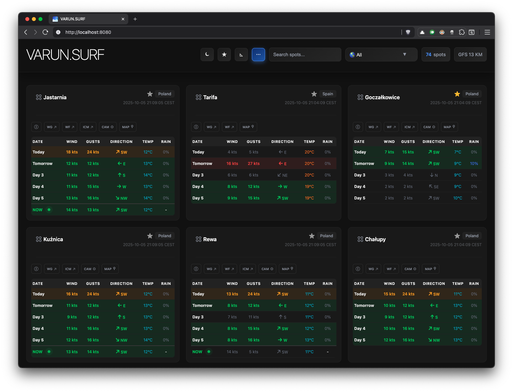

## varun.surf 🏄

[](https://github.com/pwittchen/varun.surf/actions/workflows/gradle.yml)

weather forecast and real-time wind conditions dashboard for kitesurfers

see it online at: https://varun.surf

## building backend

```
./gradlew bootJar
```

## building & running whole app

```
./run.sh
```

## testing

```
./gradlew test
```

## AI

If you want to use AI in the app, configure ollama or openai in the `application.properties`.

In case of using ollama, start it as a separate service as follows:

```
ollama serve
```

> **NOTE:** I added this feature as an experiment, but it does not really add any big value to this particular project,
so I disabled it by default. Moreover, small local LLMs like smollm where returning strange, invalid outputs 
and during local tests sometimes it got stuck, so not all the spots received analysis. 
Another interesting thing is the fact, that performing 74 calls to OpenAI with gpt-4o-mini model 
used around 31k tokens and costs $0.01, so If I would like to trigger AI analysis 
for my current configuration with this AI provider every six hours 
(4 times in 24h = 120 times in 30 days = 8880 req. / month), I'd spent around \$1.2 (~4.35 PLN) 
for monthly OpenAI usage, which is reasonable price because coffee in my local coffee shop costs more.
Nevertheless, more advanced analysis, more tokens or stronger model, should increase the price.

## screenshot



## app features

- browsing forecasts for multiple kite spots
- watching live wind conditions in the selected spots
- refreshing live wind every one minute on the backend (requires page refresh on the frontend)
- refreshing forecasts every 3 hours in the backend (requires page refresh on the frontend)
- browsing details regarding different spots like description, windguru, windfinder and ICM forecast links, location and webcam
- filtering spots by country
- searching spots
- possibility to add spots to favorites
- organizing spots order with drag and drop mechanism
- dark/light theme
- mobile-friendly UI
- kite and board calculator