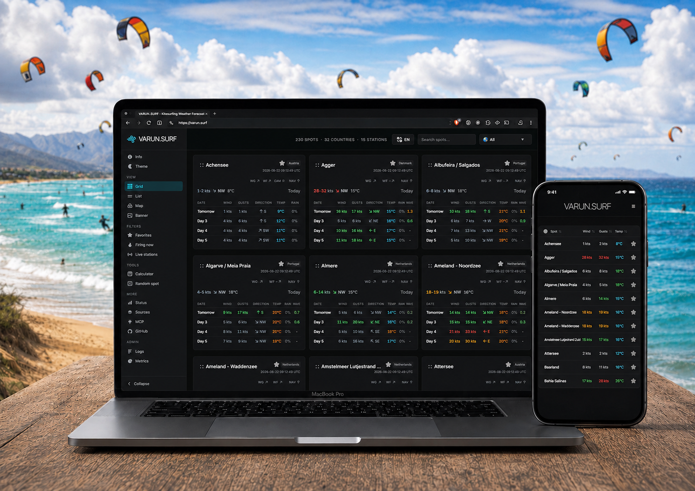
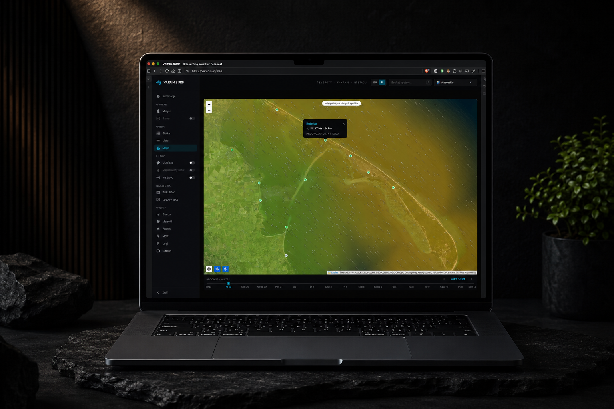

## varun.surf 🏄

[](https://github.com/pwittchen/varun.surf/actions/workflows/ci.yml)
[](https://github.com/pwittchen/varun.surf/actions/workflows/cd.yml)
[](https://github.com/pwittchen/varun.surf/actions/workflows/deps.yml)

kite spots database and weather forecast for kitesurfers on the web

see it online at: https://varun.surf

[](https://varun.surf)

[](https://varun.surf)


## tech stack overview

- **infra**: Docker, Docker Compose, Nginx, GitHub, GitHub Actions, GHCR, Cloudflare, SeoHost, Mikrus
- **backend**: Java, Spring Boot, Gradle
- **frontend** (bundled with the backend app): Vanilla JS, HTML, CSS, Bun

## building

```
./gradlew build
```

## running

```
./gradlew bootRun
```

## testing

unit testing:

```
./gradlew test
```

e2e testing:

```
./gradlew testE2e
```

e2e testing with visible browser:

```
./gradlew testE2eNoHeadless
```

## docker

```
docker build -t varun-surf .
docker run -p 8080:8080 varun-surf
```

## docker compose (local)

```
./deployment.sh dev
```

for prod setup, check [continuous delivery](#continuous-delivery) and [zero-downtime deployment](#zero-downtime-deployment) sections.

## docker container registry

docker image is automatically deployed to the registry at ghcr.io via `cd.yml` GitHub action from the `master` branch

- configure PAT (Personal Access Token) here: https://github.com/settings/tokens
- set permissions: `write:packages`, `read:packages`
- remember, you need to refresh the token in the future, once it will become outdated
- copy your access token to the clipboard

now, login into docker registry:

```
PAT=YOUR_ACCESS_TOKEN
echo $PAT | docker login ghcr.io -u pwittchen --password-stdin
```

pull image and run the container:

```
docker pull ghcr.io/pwittchen/varun.surf
docker run -p 8080:8080 ghcr.io/pwittchen/varun.surf:latest
```

## continuous integration

After each push to the master or PR, a new build is triggered with tests and test coverage report.
It's done automatically via the `ci.yml` GitHub action

## continuous delivery

After each tag push with `v` prefix, `cd.yml` GitHub action is triggered,
and this action deploys the latest version of the app to the VPS.

## zero-downtime deployment

Deployment of the app is configured with the bash, docker, and docker compose scripts.
With these scripts, we can perform zero-downtime (blue/green) deployment with nginx server as a proxy.
To do that, follow the instructions below.

- Copy `deployment.sh`, `docker-compose.prod.yml`, `.env`, and `./nginx/nginx.conf` files to the single directory on the VPS.
- In the `deployment.sh` and `docker-compose.prod.yml` files adjust server paths if needed
- In the `.env` file, configure the environment variables basing on the `.env.example` file.
- Run `./deployment.sh prod` script to deploy the app with the nginx proxy.
- Run the same command again to perform the update with a zero-downtime and the latest docker image.
- If you want to test the deployment locally, run `./deployment.sh dev` script.
- To stop everything, run: `docker stop varun-app-blue-live varun-app-green-live varun-nginx`

## api protection

The data is public and the repository is public with it, so none of this tries to stop
anyone from *reading* the API. It stops the API from being *abused* - hammered, or used
as a free backend by someone else's app.

- **rate limiting** (`nginx/nginx.conf`): 10 r/s per IP across `/api/v1/**` with a burst
  of 30 (a page load fires several calls at once), and a stricter 1 r/s for the endpoints
  that cost real work or real bytes - `/api/v1/wind`, `/llms/**`, `/mcp/**` and
  `/api/v1/logs`, where the trickle is also what stops a brute force on the basic auth.
  The two on-demand generation endpoints (`/api/v1/spots/{id}/analysis` and
  `/api/v1/spots/{id}/icm`) get their own 20 r/m: they are the only requests that spend
  money, and at the general api rate one client could walk the whole spot list and run
  up the OpenAI bill in minutes. They also get a longer proxy timeout, since the visitor
  is waiting on a model. SSE connections are capped at 4 per client. Over the limit is a 429.
- **real client address**: behind Cloudflare `$remote_addr` is the edge, so nginx trusts
  `CF-Connecting-IP` from the Cloudflare ranges listed in the config. Without this every
  visitor shares one rate-limit bucket. Refresh the ranges from
  [cloudflare.com/ips](https://www.cloudflare.com/ips/) when they change. Note this
  assumes traffic reaches nginx through Cloudflare: a client able to hit the origin port
  directly could set the header itself.
- **session cookie** (`SessionAuthenticationFilter`): a signed stateless token issued on
  any page visit and required by `/api/v1/**`. It costs a scraper one extra request and
  nothing more - `/llms/**` and `/mcp/**` serve the same data without it, by design.
- **fail-closed logs**: with no `ANALYTICS_PASSWORD` set, `/api/v1/logs` is denied rather
  than opened to everyone holding a cookie. Set the variable or the logs page stays dark.
- **security headers**: `X-Content-Type-Options`, `Referrer-Policy`, `Permissions-Policy`
  and HSTS are set by nginx. The CSP is deliberately `Content-Security-Policy-Report-Only`
  - the frontend carries inline styles and scripts, so enforcing it as-is would break
  pages. Watch the console for violations, tighten, then rename the header.

The strongest lever is not in this repository: Cloudflare's *Bot Fight Mode* and WAF rate
limiting rules filter automated traffic at the edge, before it reaches the VPS at all.

## cache busting

Updated styles, scripts, and images are visible right after a deployment, without waiting for the
Cloudflare edge cache or a browser cache to expire. This works on three levels:

- **content-hashed assets**: CSS, JS, and the logo are emitted as `/assets/<name>.<hash>.<ext>` by the
  frontend build, spot photos get a `?v=<content hash>` suffix. A changed file means a changed URL.
- **cache headers** (`CacheControlFilter`): hashed assets are `immutable` for a year, HTML is always
  revalidated (so pages never keep pointing at stale asset URLs), unversioned files are cached for
  5 minutes, API and actuator responses are `no-store`.
- **cache purge on deploy**: when `CLOUDFLARE_ZONE_ID` and `CLOUDFLARE_API_TOKEN` are set in the `.env`
  file, `deployment.sh` purges the Cloudflare cache once the new version is live. The API token needs
  the *Zone → Cache Purge* permission. Without these variables the purge step is skipped.

In Cloudflare, keep *Browser Cache TTL* set to **Respect Existing Headers**, otherwise the dashboard
setting overrides the headers described above.

## monitoring

We can view system status, by visiting [/status](https://varun.surf/status) page.
Data sources are listed on the [/sources](https://varun.surf/sources) page.

### actuator metrics

We can enable application and JVM metrics in the `application.yml` file and then use `/actuator/prometheus` endpoint to view metrics.

### built-in metrics dashboard

The app includes a custom metrics dashboard at [/metrics](https://varun.surf/metrics) that displays:

- **Application gauges**: total spots, countries, active live stations, cache sizes, last fetch timestamps
- **Fetch counters**: forecast/conditions/AI fetch totals, successes, and failures
- **API request counters**: spots and single spot endpoint request counts
- **Timers**: forecast, conditions, and AI fetch durations (count, total time, mean, max)
- **JVM metrics**: heap/non-heap memory usage, thread counts, GC pause stats, CPU usage, uptime
- **HTTP client metrics**: active/total/success/failed requests, connection stats, DNS/connect durations
- **Wide/narrow view toggle**: expand to full width for better readability

The metrics dashboard needs no password: it is open to any visitor of the site.

### built-in logs dashboard

The app includes a logs dashboard at [/logs](https://varun.surf/logs) that displays:

- **Real-time application logs** with auto-refresh every 5 seconds
- **Level filtering**: filter by ERROR, WARN, INFO, DEBUG, or TRACE
- **Text search**: search through log messages, logger names, and thread names
- **Wide/narrow view toggle**: expand to full width for better readability
- **In-memory buffer**: stores the last 1000 log entries (oldest logs are evicted when buffer is full)

Note: Logs are stored in memory only and are lost on application restart.

**Configuration:**

The logs dashboard is the only password-protected one. Set your password in the `.env` file:
```
ANALYTICS_PASSWORD=your-secure-password
```

## ai forecast analysis

It's possible to enable AI/LLM in the app, so a spot can get an AI-generated comment on its forecast.
If you want to use AI in the app, configure OpenAI API key in the `application.yml`.

An exemplary docker command to run the app with enabled AI analysis:

```
docker run -p 8080:8080 varun-surf \
    --app.feature.ai.forecast.analysis.enabled=true \
    --spring.ai.openai.api-key=your-api-key-here
```

Nothing is generated in the background. The analysis is written only when someone
presses "generate AI analysis" on a spot page, and then held for 24 hours - so a
reload, or a second visitor on the same spot that day, costs nothing. The same
applies to the ICM forecast, which is read off the meteogram image by a vision
model from its own button.

> **NOTE:** I added this feature as an experiment, but it does not really add any big value to this particular project,
so I disabled it by default. It also used to run on a timer - a daily pass over every spot in two languages, plus an
ICM meteogram reading every three hours for each Polish and Czech spot - which spent most of the budget on spots
nobody opened that day. On-demand generation ties the cost to what people actually look at, and stops it growing
with the spot list. A single analysis is roughly 2.2-2.5k input tokens on gpt-4o-mini; reading an ICM meteogram is
far more expensive, because the image alone is ~25k tokens.

## architecture

- **Backend Architecture** → see [docs/BACKEND.md](docs/BACKEND.md) file
- **Frontend Architecture** → see [docs/FRONTEND.md](docs/FRONTEND.md) file

## ai coding agents configuration

- Claude → see: [CLAUDE.md](CLAUDE.md) file
- Codex → see: [AGENTS.md](AGENTS.md) file

### custom agent triggers

The project includes specialized Claude Code agents that can be triggered using shortcuts:

| Trigger | Agent | Purpose |
|---------|-------|---------|
| `@new-kite-spot [location]` | kite-spot-creator | Research and add a new kite spot to spots.json |
| `@new-weather-station [url]` | weather-station-strategy | Create a new weather station integration strategy |
| `@debug-api [target]` | api-debugger | Diagnose issues with external APIs (Windguru, weather stations, maps) |
| `@e2e-test [feature]` | e2e-test-writer | Write E2E tests for features using Playwright |
| `@review [file/feature]` | code-reviewer | General code review for quality, bugs, and best practices |
| `@arch [topic]` | arch-analyzer | System architecture analysis, dependencies, and design patterns |
| `@security [target]` | security-auditor | Security vulnerability assessment and OWASP compliance |
| `@perf [target]` | perf-analyzer | Performance analysis for speed, memory, and resource optimization |
| `@async [target]` | async-reviewer | WebFlux/Reactor patterns, Virtual Threads, and concurrency review |

**Examples:**

```
@new-kite-spot Tarifa, Spain
@new-weather-station https://holfuy.com/en/weather/1234
@debug-api windguru spot 48009
@e2e-test favorites feature
@review AggregatorService
@arch data flow from API to caching
@security check input validation in controllers
@perf analyze caching efficiency
@async review StructuredTaskScope in AggregatorService
```

Agent definitions are located in `.claude/agents/`.

Remember that you can also trigger agents by natural language according to Claude Code guidelines.

### custom skills

The project includes Claude Code skills that can be invoked as slash commands. Skills are lightweight, focused tasks that run directly in the conversation.

**How to use:**
1. Type the run + slash command in Claude Code (e.g., `/check-spots`)
2. For skills with arguments, add them after the command (e.g., `/explain caching flow`)
3. Skills run immediately and return a structured report

**Examples:**

```
/check-spots
/explain caching flow
```

| Command | Purpose |
|---------|---------|
| `/check-spots` | Validate spots.json for missing fields, invalid URLs, duplicates, and data consistency |
| `/check-live-stations` | Analyze live weather station integrations, test data sources, identify spots without live data |
| `/explain [topic]` | Explain data flows, features, and code paths with visual diagrams and step-by-step breakdowns |
| `/review [target]` | Quick code review for files or git changes, checking for bugs and best practices |
| `/audit-security` | Security audit for secrets, SSRF, injection points, dependencies, and headers |
| `/check-deps` | Analyze Gradle dependencies for outdated versions, CVEs, conflicts, and bloat |
| `/profile-blocking` | Find blocking calls in reactive WebFlux code that cause thread starvation |
| `/check-concurrency` | Find race conditions, deadlocks, unsafe shared state, and synchronization issues |
| `/arch-check` | Verify architecture health: layer violations, circular deps, design patterns |
| `/check-errors` | Find error handling gaps: swallowed exceptions, missing handlers, resource leaks |
| `/varun [question]` | Answer questions about kite spots, forecasts, and live wind conditions via varun.surf's public `llms.txt` endpoints |
| `/update-docs [topic]` | Update README, CLAUDE.md, AGENTS.md and `docs/` to match the current code, and sweep for stale counts, trees and endpoints |
| `/commit [hint]` | Stage and commit current changes with a message following project conventions |

Skill definitions are located in `.claude/skills/`.

## features

- showing all kite spots with forecasts and live conditions on the single page without switching between tabs or windows
- browsing forecasts for multiple kite spots
- browsing all kite spots on the map (Open Street Maps)
- watching live wind conditions in the selected spots
- refreshing live wind every one minute on the backend (requires page refresh on the frontend)
- refreshing forecasts every 3 hours in the backend (requires page refresh on the frontend)
- browsing details regarding different spots like description, windguru, windfinder and ICM forecast links, location and webcam
- filtering spots by country
- searching spots
- searching for another spot straight from the single spot view (desktop), which jumps to the spot picked
- possibility to add spots to favorites
- organizing spots in the custom order with a drag and drop mechanism
- dark/light theme
- possibility to switch between a list view and a grid view
- mobile-friendly UI
- kite and board size calculator
- AI forecast analysis, generated on demand from a button under the spot map, written in Polish and English at once so the language switch keeps working, and valid for 24 hours
- ICM forecast generated on demand from a button under the AI analysis, valid for 24 hours
- single spot view with hourly forecast (in horizontal and vertical view)
- additional TV-friendly view for the single spot
- map of the spot (Open Street Maps, zoomed in on the spot)
- wind field overlay on the maps (heatmap and animated wind particles) with an hourly forecast timeline
  stepping through the whole forecast run on a desktop, five days on a phone
- spot visibility toggle on the main map, hiding the markers and clusters so the wind field
  can be read on its own
- map popups reading the wind, gusts and direction of the hour the forecast timeline stands on,
  following it as it steps
- sidebar navigation shared by every page, with a mobile drawer
- link to the navigation app (Google Maps)
- displaying a photo of the spot (if available)
- dynamic weather forecast model selector (40+ Windguru models, auto-discovered per spot)
- embeddable HTML widget with current conditions, forecast or a map with the wind field
  and a 5-day forecast slider for the spot
- session cookie authentication for API access (prevents direct API scraping without visiting the site)
- hero section with random spot photo, name/location, and slogan in PL and EN, hidden from the photo
  itself and brought back with the Banner button in the sidebar
- automatic language detection from browser settings
- stale live conditions indicators (yellow for outdated data)
- fallback weather station mechanism (automatic switch when primary returns stale data)
- LLM-friendly Markdown endpoints at `/llms/*.md` (public, no session cookie) for AI crawlers and agents
- Built-in MCP (Model Context Protocol) server at `/mcp/sse` exposing spots, forecasts, and live conditions as tools for Claude Code and other AI assistants

## mcp server

The app exposes a [Model Context Protocol](https://modelcontextprotocol.io) server so AI assistants can query kite spots, forecasts, and live wind conditions as tools.

The server is built into the Spring Boot app (Spring AI 1.0.x `spring-ai-starter-mcp-server-webflux`) and runs over Server-Sent Events at:

| Path | Description |
|------|-------------|
| `GET /mcp/sse` | SSE stream — clients connect here to receive server events |
| `POST /mcp/message` | Message endpoint — clients send JSON-RPC requests here |

Both paths are public (no session cookie required), same as `/llms/*.md`.

### available tools

| Tool | Description |
|------|-------------|
| `list_spots` | Markdown index of all kite spots, grouped by country |
| `get_spot` | Full spot details (overview, current conditions, daily/hourly forecast, links) by Windguru spot ID (`wgId`) |
| `get_wind_forecast` | Hour-by-hour wind, gusts and direction for one spot (`wgId`), optionally limited to a number of hours and a minimum wind speed |
| `find_spot_by_name` | Search spots by case-insensitive substring match |
| `find_windy_spots` | Scan every spot's hourly wind at once for the ones reaching a given wind speed, optionally within one country |
| `list_countries` | List all countries with spot counts |
| `get_spots_by_country` | List spots in a country by slug (e.g. `poland`, `czech-republic`) |
| `get_status` | Quick summary of spots / countries / live stations counts |

### claude code installation

Add the production server:

```
claude mcp add --transport sse varun-surf https://varun.surf/mcp/sse
```

Or for a local development server:

```
claude mcp add --transport sse varun-surf-local http://localhost:8080/mcp/sse
```

Verify it's connected:

```
claude mcp list
```

You can now ask Claude things like *"what's the wind forecast for Jastarnia tomorrow?"* or *"list all kite spots in Spain"*, and it will call the relevant tool on the varun.surf MCP server.

The [/mcp](https://varun.surf/mcp) page displays the live MCP endpoint URL, a ready-to-use JSON config
and a one-click copy of the install command, along with the list of available tools.

### configuration

MCP-related configuration in `application.yml`:

```yaml
spring:
  ai:
    mcp:
      server:
        enabled: true
        name: varun-surf
        version: ${version}
        type: ASYNC               # WebFlux uses async transport
        sse-endpoint: /mcp/sse
        sse-message-endpoint: /mcp/message
```

To disable the MCP server entirely set `spring.ai.mcp.server.enabled=false`.

## llm-friendly markdown endpoints

The app exposes a set of public Markdown documents under `/llms/*.md` for LLMs, AI crawlers and agents.
These endpoints are **not** gated by the session cookie (unlike `/api/v1/**`) and are linked from `/llms.txt`.

| Endpoint | Description |
|----------|-------------|
| `GET /llms/spots.md` | Index of all kite spots with links to per-spot documents and a list of countries |
| `GET /llms/spots/{wgId}.md` | Full spot document: overview, current conditions (when available), daily/hourly forecast, links |
| `GET /llms/spots/{wgId}/wind.md` | One spot's wind hour by hour: wind, gusts and direction, with the windiest hour called out |
| `GET /llms/wind.md` | Every spot reaching a given wind speed in the hours ahead, strongest first |
| `GET /llms/countries.md` | Index of all countries with spot counts |
| `GET /llms/countries/{slug}.md` | Spots available in the given country |

The country `{slug}` is the lowercased country name with spaces replaced by hyphens (e.g. `poland`, `czech-republic`).
All responses are served as `text/markdown; charset=UTF-8` and use the same in-memory caches as the JSON API.

The two wind documents read the same grid-aligned hourly forecast `/api/v1/forecast/{wgId}` and
`/api/v1/wind` serve, and take optional query parameters:

| Endpoint | Parameters |
|----------|------------|
| `/llms/spots/{wgId}/wind.md` | `hours` (ahead, default 72), `minWind` (knots, default: list every hour) |
| `/llms/wind.md` | `minWind` (knots, default 12), `hours` (ahead, default 24), `country` (name or slug), `limit` (default 20, max 100) |

An unknown spot or country answers 404; a span longer than the forecast reaches is trimmed to what there is.

## data sources

Forecasts come from [Windguru](https://www.windguru.cz), [Windfinder](https://www.windfinder.com)
and [ICM Meteo](https://www.meteo.pl). Live wind comes from the weather stations listed on the
[sources page](https://varun.surf/sources), which also lists the sources behind the spot
database itself:

| Source | Contribution |
|--------|--------------|
| [Kitewetter](https://www.kitewetter.at/) | Alpine kite spots in Austria |
| [Nederlandse Kitesurf Vereniging](https://kitesurfvereniging.nl/spotkaart/) | Dutch kite spots, their access rules and local restrictions |
| [Dziobak](http://www.dziobak.pl/) | Polish inland and Puck Bay spots, plus wind/wing/kite destinations abroad |

The NKV spotkaart is maintained by a network of volunteer spot managers who keep Dutch kite spots
open and safe — the local knowledge in the Netherlands entries comes from their work. Spots the
NKV lists as *verboden* (forbidden) are deliberately not included here.
